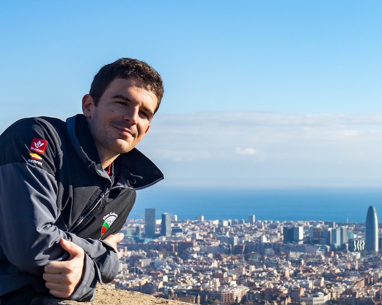

{/* ## Descargar CV

  

    Haz click para <a href="/crew.pdf">ver CV y descargar</a>.
  

 */}

# Titulación naútica

- **STCW**, seguridad básica
- **PER**, patrón de embarcación de recreo
- **PY**, patrón de yate
- **ROCA**, radio operador de corto alcance
- **Marinero de puerto**, curso Port Olimpic

**Libreta de navegación marítima al día y lista para embarcar**

## Descripción

- **Edad**: 26 años
- **Educación**: cursando máster
- **Nacionalidad**: española
- **Idiomas**: italiano, catalán/valenciano e inglés
- **Actualmente en**: Barcelona 
- **Habilidades**: uso de sextante, costura de velas, mantenimiento de veleros, reconozco algunas constelaciones, sociable y fotografía.
- **Intereses**: PPER y vela.

## Experiencia navegando

Realicé prácticas de marinero en Port Olímpic en diciembre de 2023, enfocándome en amarres, nudos y tareas de baradero. Además, he participado en numerosas travesías, destacando las exploraciones a las islas Baleares, donde he consolidado mis habilidades náuticas y mi pasión por la navegación.

### Resumen
Desde mi infancia, la vela ha ejercido sobre mí una fascinación constante. En las aguas de Jávea (Xàbia), un pueblo de pescadores (lo era) cerca del Cap de la Nau, absorbí meticulosamente el extenso vocabulario y las normas de navegación que me fueron transmitidos desde temprana edad. En ese entorno, desarrollé una afinidad innata con la comprensión del viento, los nudos y la familiaridad con el puerto.

A lo largo de los años, cada vez que se presentó la oportunidad, me sumergí en travesías a bordo de veleros pertenecientes a amigos, viviendo rápidas escapadas que contribuyeron significativamente a perfeccionar mis habilidades en maniobras náuticas, manejo de cartas y otros trucos propios del mar.

Con el deseo de convertir mi pasión en profesión, obtuve los títulos de navegación necesarios. Posteriormente, encontré una valiosa oportunidad al ser uno de los pioneros al participar en un curso de marinero en Port Olímpic, Barcelona. Este curso no solo amplió mis conocimientos sobre el mantenimiento de embarcaciones, sino que también profundizó en los detalles de los nudos y el cuidado de cabos, brindándome una base sólida para seguir creciendo en mi amor por la navegación.

Actualmente, estoy en búsqueda de oportunidades laborales relacionadas con llevar charters o veleros. Aspiro a dar la vuelta al mundo y obtener el PPER, ampliando así mi experiencia y consolidando mi trayectoria en el emocionante mundo de la navegación.

