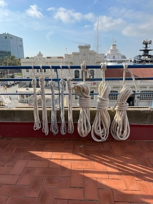
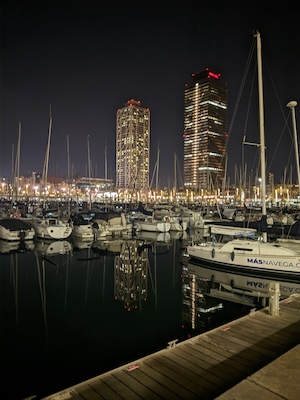
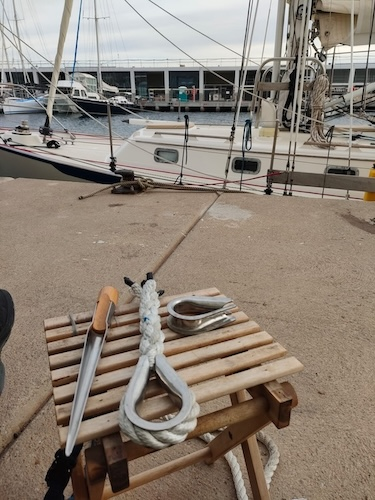

# Sobre el curso

- Instituto Naútico de Barcelona
- Port Olimpic
- Ayuntamiento de Barcelona

Puedes ver una publicación del Períodico sobre este curso [aquí](https://www.elperiodico.com/es/blau/20231221/nueva-profesion-marineros-de-puerto-formacion-titulacion-port-olimpic-barcelona-96134507) .

## Resumen

El curso que cursamos fue diseñado como una preparación integral para participar en la Copa América. A lo largo de las sesiones, nos sumergimos en diversas habilidades y conocimientos fundamentales para desenvolvernos eficientemente en el ámbito náutico. Una parte esencial del aprendizaje fue la adquisición de habilidades prácticas, como la creación de nudos náuticos esenciales.

Durante las clases, dedicamos tiempo a perfeccionar nuestras técnicas de amarre y anudado, reconociendo la importancia de estos procedimientos en la seguridad y estabilidad de los barcos en alta mar. Además, nos sumergimos en la esfera de las reparaciones de embarcaciones, aprendiendo a abordar situaciones comunes que podríamos enfrentar durante la competición.

Una parte crucial del curso se centró en el desarrollo del vocabulario náutico en inglés. Dada la naturaleza internacional de la Copa América, era vital que todos los participantes pudieran comunicarse efectivamente en este idioma. Se nos proporcionó un amplio repertorio de términos específicos de la navegación, permitiéndonos comprender y expresarnos con claridad durante las interacciones en el entorno náutico.

La atención al cliente también fue un componente importante del programa. Dado que la Copa América no solo se trata de habilidades técnicas, sino también de la experiencia general para los espectadores y patrocinadores, se nos instruyó sobre cómo brindar un servicio excepcional. Desde la cortesía en la comunicación hasta la resolución de problemas, se nos preparó para gestionar cualquier situación que pudiera surgir durante el evento.

La práctica de estos conocimientos no se limitó al aula; realizamos ejercicios prácticos en el puerto para aplicar lo aprendido. Estas sesiones prácticas incluyeron simulacros de remolque, donde pusimos en práctica nuestras habilidades de navegación y maniobra en condiciones diversas. Esta experiencia en el puerto no solo consolidó nuestros conocimientos, sino que también nos permitió enfrentarnos a situaciones realistas que podríamos encontrar durante la competición.

En resumen, el curso fue una inmersión completa en el mundo náutico, proporcionándonos las habilidades técnicas, el vocabulario necesario y la capacidad de brindar un servicio de calidad para enfrentar los desafíos y exigencias de la Copa América.

## Fotos

Cabos adujados

Port Olimpic de noche

Practicando trenzado
