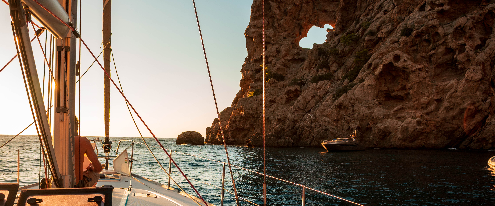
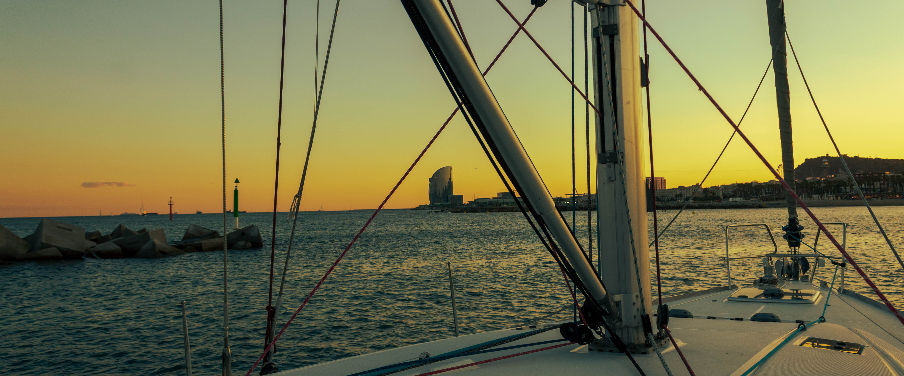
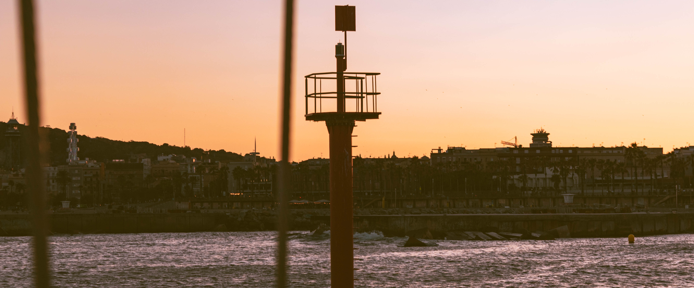

# Del 22 al 23 de septiembre 

Nuestra travesía se volvió una experiencia desafiante cuando nos enfrentamos a vientos de hasta 35 nudos. El barco se mecía violentamente en las aguas tumultuosas, y la furia del viento golpeaba con fuerza. A pesar de la pericia de la tripulación, la navegación se convirtió en un verdadero desafío.

En medio de la tormenta, la salud de uno de nuestros compañeros se vio afectada de manera notable. Fue desgarrador verlo luchar contra las olas de mareo mientras vomitaba incesantemente durante lo que pareció una eternidad. La combinación de las condiciones meteorológicas adversas y la preocupación por la salud de nuestro amigo creó un ambiente tenso a bordo.

Las olas, caprichosas y desordenadas, nos golpeaban desde todos los ángulos posibles, haciendo que la navegación fuera aún más complicada. El mar se transformó en un escenario caótico donde la embarcación se veía desafiada en cada momento. A pesar de las habilidades del capitán y la tripulación, cada maniobra era crucial para mantener el control del barco.

Afortunadamente, el hecho de que estuviéramos en septiembre mitigó en parte las dificultades. Aunque el viento soplaba fuerte y las olas se agitaban, la temperatura en el Mediterráneo seguía siendo tolerable. El alivio de no tener que enfrentarnos a temperaturas extremadamente frías fue un consuelo en medio de la adversidad.

A medida que navegábamos en medio de la tormenta, la camaradería y la solidaridad entre la tripulación se volvieron fundamentales. Nos apoyamos mutuamente, compartiendo palabras de aliento y realizando las tareas necesarias con determinación. A pesar de las dificultades, la travesía nos recordó la importancia de trabajar juntos en equipo frente a los desafíos imprevistos que el mar nos presentaba.

Finalmente, a medida que dejamos atrás la tormenta y las condiciones mejoraron, el alivio y la sensación de superación se apoderaron de nosotros. A pesar de la complicada travesía, habíamos enfrentado con valentía los elementos y demostrado que, incluso en medio de la adversidad, la camaradería y la determinación pueden llevarnos a superar cualquier obstáculo en el vasto e impredecible océano.

## Fotos

Cala cerca de Soller, Mallorca

Port Olimpic

Port Olimpic
