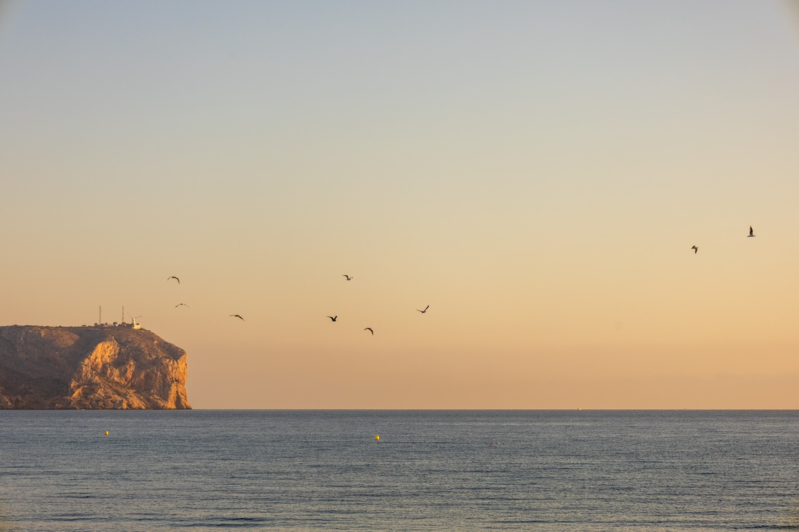

# Aprendiendo a navegar

Comencé mi travesía en el mundo de la navegación a una edad temprana, zarpando con pequeñas embarcaciones, al igual que muchos niños que se inscriben en el club náutico para disfrutar del verano. Aquella experiencia se asemejaba a un juego: aprendíamos a atar nudos, a aprovechar el viento y a nadar, convirtiendo cada día en una aventura llena de diversión.

A medida que crecí, dejamos atrás los pequeños barcos y nos aventuramos en gambas, embarcaciones medianas que, aunque más pequeñas que un j/80, nos enseñaban la importancia de la navegación en equipo. Esta fase marcó un cambio en la forma en que abordábamos el mar, fusionando destrezas individuales para alcanzar metas comunes.

Hoy en día, continúo visitando el puerto regularmente y siempre que tengo la oportunidad, me lanzo a navegar. Mi pasión alcanza su punto culminante cuando me dirijo hacia las hermosas islas Baleares desde Denia, una travesía que fusiona la destreza marítima con la belleza natural, proporcionándome una conexión única con el océano y una profunda satisfacción.

## Fotos del pueblo en el que aprendí

Xàbia ha mantenido una rica tradición pesquera a lo largo de los años. Mi abuelo solía caminar por la "tosca", un peculiar tipo de piedra que caracteriza la zona, mientras pescaba con un sencillo palo terminado en punta. Sin embargo, es innegable que todo ha experimentado un cambio significativo. La llegada de nuevas construcciones, el auge del turismo y la creciente contaminación han transformado radicalmente el paisaje marino. Ahora, lamentablemente, solo se pueden avistar algunos erizos y poco más, evidenciando la transformación que ha experimentado este enclave.

